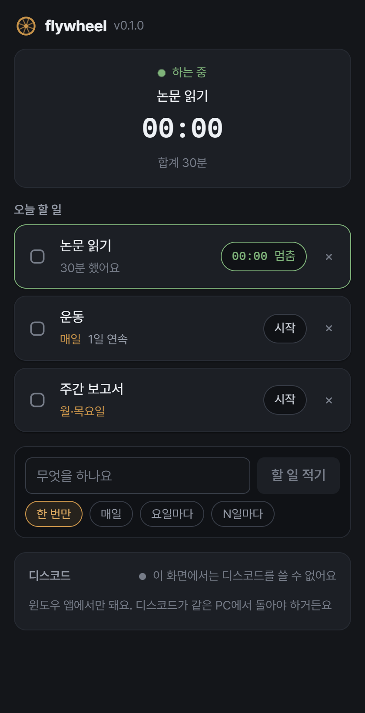

<a id="readme-top"></a>

[![Contributors][contributors-shield]][contributors-url]
[![Forks][forks-shield]][forks-url]
[![Stargazers][stars-shield]][stars-url]
[![Issues][issues-shield]][issues-url]
[![MIT License][license-shield]][license-url]

<br />
<div align="center">
  <a href="https://github.com/dev1f965x/flywheel">
    
  </a>

  <h3 align="center">flywheel</h3>

  <p align="center">
    A to-do list that keeps time. Repeat what should repeat, start it, and let Discord show what you are on.
    <br />
    <a href="https://dev1f965x.github.io/flywheel/">Open it »</a>
    ·
    <a href="docs/product.md">Explore the docs</a>
    ·
    <a href="https://github.com/dev1f965x/flywheel/releases">Download</a>
    ·
    <a href="https://github.com/dev1f965x/flywheel/issues/new?labels=bug">Report Bug</a>
    ·
    <a href="https://github.com/dev1f965x/flywheel/issues/new?labels=feature">Request Feature</a>
  </p>
</div>

<details>
  <summary>Table of Contents</summary>
  <ol>
    <li>
      <a href="#about-the-project">About The Project</a>
      <ul>
        <li><a href="#built-with">Built With</a></li>
      </ul>
    </li>
    <li>
      <a href="#getting-started">Getting Started</a>
      <ul>
        <li><a href="#prerequisites">Prerequisites</a></li>
        <li><a href="#installation">Installation</a></li>
      </ul>
    </li>
    <li><a href="#usage">Usage</a></li>
    <li><a href="#roadmap">Roadmap</a></li>
    <li><a href="#license">License</a></li>
    <li><a href="#contact">Contact</a></li>
    <li><a href="#acknowledgments">Acknowledgments</a></li>
  </ol>
</details>

## About The Project

<div align="center">
  
</div>

Three habits, three apps: a to-do list holding what should be done, a timer holding how
long it took, and a routine tracker holding what repeats. None of them knows the others,
so the day is written down three times and measured in none of them.

flywheel is the one list.

- **Tasks** are written a line at a time and finished with a tap.
- **Routines** are tasks that repeat: every day, on chosen weekdays, or every N days.
  Finishing one schedules the next, and the days kept in a row are counted.
- **The clock** starts when a task starts. One runs at a time, and everything is derived
  from the instants recorded, so a closed window, a sleeping laptop and a reboot make no
  difference.
- **Discord** shows what is running, counted from when it started, on the desktop build,
  which is the only place Rich Presence can reach.
- Everything stays on the device. No account, no sync, no analytics.

<p align="right">(<a href="#readme-top">back to top</a>)</p>

### Built With

[](https://tauri.app/)
[](https://www.rust-lang.org/)
[](https://react.dev/)
[](https://www.typescriptlang.org/)
[](https://vite.dev/)
[](https://playwright.dev/)
[](https://vitest.dev/)
[](https://biomejs.dev/)
[](https://docs.github.com/actions)

<p align="right">(<a href="#readme-top">back to top</a>)</p>

## Getting Started

### Prerequisites

Nothing, to use it in a browser. For the Discord status: the Windows build, the Discord
app running on the same machine, and an application of your own from the
[Discord developer portal](https://discord.com/developers/applications) — its Application
ID goes in the app, and its name is what your friends see.

To build it: [Node.js](https://nodejs.org) 24, [Rust](https://rustup.rs) stable, and the
[Tauri prerequisites](https://tauri.app/start/prerequisites/) — plus the Android SDK and
NDK for the APK.

### Installation

- **Web** — <https://dev1f965x.github.io/flywheel/>. Nothing to install, and it keeps
  working offline once loaded. No Discord: a browser tab cannot reach it.
- **Windows** — the `*-setup.exe` from the
  [latest release](https://github.com/dev1f965x/flywheel/releases/latest). It is unsigned,
  so SmartScreen warns once: **More info** → **Run anyway**. It updates itself from then
  on, and it is the build that talks to Discord.
- **Android** — the `.apk` from the same release. Android asks once for permission to
  install an app from outside the Play Store.

From source:

```sh
git clone https://github.com/dev1f965x/flywheel.git
cd flywheel
npm install
npm run dev                # the page
npm run tauri dev          # the window
npm run tauri android dev  # the app, on a phone or an emulator
```

<p align="right">(<a href="#readme-top">back to top</a>)</p>

## Usage

1. Write what you are doing, and pick how it repeats — **한 번만**, **매일**, **요일마다**,
   or **N일마다**.
2. **시작** starts the clock. Starting another task stops the first; **멈춤** ends it.
3. Tap the box to finish. A routine comes back on its next day with its streak; a one-off
   stays in **끝낸 일**, struck through.

For the Discord status, turn **하는 일 보여주기** on and paste your Application ID. The
card says whether Discord is connected; with Discord closed it waits and retries, and
nothing else stops working.

The interface is in Korean.

<p align="right">(<a href="#readme-top">back to top</a>)</p>

## Roadmap

- [x] 1.0.0 — tasks, routines, the clock, Discord on the desktop, on web, Windows, Android
- [ ] 1.1.0 — a week's worth of totals, and editing a session left running too long
- [ ] later — tags, if the flat list proves too flat

See the [open issues](https://github.com/dev1f965x/flywheel/issues) for the full list.

<p align="right">(<a href="#readme-top">back to top</a>)</p>

## License

Distributed under the MIT License. See [`LICENSE`](LICENSE).

<p align="right">(<a href="#readme-top">back to top</a>)</p>

## Contact

[@dev1f965x](https://github.com/dev1f965x) — https://github.com/dev1f965x/flywheel

<p align="right">(<a href="#readme-top">back to top</a>)</p>

## Acknowledgments

- [Pretendard](https://github.com/orioncactus/pretendard) — SIL Open Font License 1.1, see [`licenses/`](licenses)
- [discord-rich-presence](https://github.com/vionya/discord-rich-presence)
- [Shields.io](https://shields.io)
- [Best-README-Template](https://github.com/othneildrew/Best-README-Template)

<p align="right">(<a href="#readme-top">back to top</a>)</p>

[contributors-shield]: https://img.shields.io/github/contributors/dev1f965x/flywheel.svg?style=for-the-badge
[contributors-url]: https://github.com/dev1f965x/flywheel/graphs/contributors
[forks-shield]: https://img.shields.io/github/forks/dev1f965x/flywheel.svg?style=for-the-badge
[forks-url]: https://github.com/dev1f965x/flywheel/network/members
[stars-shield]: https://img.shields.io/github/stars/dev1f965x/flywheel.svg?style=for-the-badge
[stars-url]: https://github.com/dev1f965x/flywheel/stargazers
[issues-shield]: https://img.shields.io/github/issues/dev1f965x/flywheel.svg?style=for-the-badge
[issues-url]: https://github.com/dev1f965x/flywheel/issues
[license-shield]: https://img.shields.io/github/license/dev1f965x/flywheel.svg?style=for-the-badge
[license-url]: https://github.com/dev1f965x/flywheel/blob/main/LICENSE
